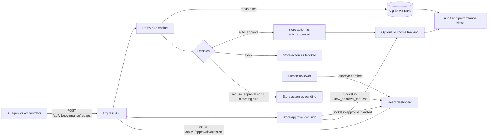
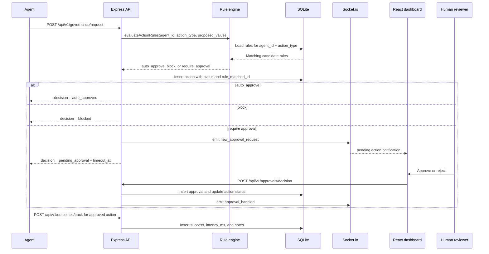

# AgentGovernance

Governance middleware for AI agents with deterministic policy enforcement and human approval.

## Problem

AI agents can propose actions that should not always execute automatically. A price change, outbound message, record update, or external API call may be valid in one context and unsafe in another. The repository models that problem as an action-level control point: an agent submits a proposed action, the backend evaluates configured policy rules, and the action receives an explicit decision before execution.

This project is not an agent framework and does not execute agent actions itself. It is a governance layer that sits between an agent and whatever system would perform the action.

## Solution

AgentGovernance provides a small API-first governance service:

1. Register a human owner and an agent.
2. Configure per-agent rules for specific `action_type` values.
3. Submit proposed actions to `POST /api/v1/governance/request`.
4. Return one of three decisions:
   - `auto_approved` when a matching rule allows the action.
   - `blocked` when a matching rule denies the action.
   - `pending_approval` when a rule requires review or no rule matches.
5. Store the action, matched rule, status, timestamps, reviewer decision, and optional execution outcome for audit and reporting.

The default behavior is conservative: if no policy rule matches an action, the rule engine returns `require_approval`, which queues the request for human review instead of allowing it silently.

## Architecture



The implementation is a Node.js workspace with two packages:

- `packages/api`: Express HTTP server, Socket.io server, Knex-backed SQLite database initialization, REST routes, policy evaluation, and timeout workers.
- `packages/dashboard`: React/Vite frontend that fetches agents, rules, pending approvals, audit data, and performance metrics from the API; it also listens for Socket.io approval events.

The API initializes its SQLite tables at startup in code rather than through migration files. `DB_PATH` can override the SQLite file path; otherwise the API uses `./governance.sqlite` relative to the API process working directory.

`docker-compose.yml` defines Postgres and Redis services, but the current API code does not connect to either service. Treat that file as infrastructure scaffolding, not as the active persistence or worker runtime.

## Action Lifecycle



## Policy Decisions

Rules are stored in the `rules` table with an `agent_id`, `action_type`, JSON `condition`, and `consequence`. The rule engine loads rules for the submitted agent and action type, evaluates each condition against `proposed_value`, and returns the highest-severity matching consequence.

Supported condition forms:

- Single-field comparison: `{ "field": "change_percentage", "operator": "gt", "threshold": 0.1 }`
- `AND` arrays for all conditions matching.
- `OR` arrays for at least one condition matching.

Supported operators are `eq`, `neq`, `gt`, `gte`, `lt`, `lte`, and `contains`. If no rule exists or no condition matches, the engine returns `require_approval` with no matched rule id.

Consequence severity is explicit in the implementation:

1. `auto_approve`
2. `require_approval`
3. `block`

That means a blocking rule wins over review or approval when multiple rules match the same action.

## Human Review

Human review is implemented through the approvals API and dashboard:

- Pending actions are available from `GET /api/v1/approvals/pending`.
- The governance route emits `new_approval_request` through Socket.io when an action is queued.
- The dashboard fetches pending approvals on load and refreshes when it receives the Socket.io event.
- Reviewers submit `approved` or `rejected` to `POST /api/v1/approvals/decision`.
- Rejections require a reason.
- The API writes an `approvals` row, updates the action to `approved` or `rejected`, sets `resolved_at`, and emits `approval_handled` so dashboards remove the handled item.

There is no full authentication middleware yet. The MVP key-generation routes create users, agents, and API key records, but request authorization is not enforced on protected routes.

## Audit Trail

The database records the key pieces needed to reconstruct a governance decision:

- `actions`: agent id, action type, proposed JSON payload, agent reasoning, matched rule id, status, creation time, resolution time, and approval timeout.
- `approvals`: approver id, decision, rejection reason when supplied, and decision timestamp.
- `outcomes`: success flag, latency in milliseconds, notes, and recorded timestamp for approved or auto-approved actions.

`GET /api/v1/audit?agent_id=...` joins actions with approval/user data and returns the recent decision history for an agent. `GET /api/v1/agents/:agent_id/performance` derives all-time action count, success rate, average latency, and user acceptance rate from recorded actions, approvals, and outcomes.

## Testing

There is currently no automated test suite checked into the repository. The API package has a placeholder `npm test` script that exits with an error, while the dashboard package provides build and lint scripts.

Useful checks for the current repository state:

```bash
cd packages/api
npx tsc --noEmit
```

```bash
cd packages/dashboard
npm run build
npm run lint
```

## Tech Stack

| Area | Implementation present in this repo |
| --- | --- |
| Backend | Node.js, TypeScript, Express |
| Realtime | Socket.io server and Socket.io React client |
| Database | SQLite through Knex |
| Frontend | React, Vite, TypeScript |
| HTTP client | Axios in the dashboard |
| Identifiers | UUIDs |
| Local services scaffold | Docker Compose for Postgres and Redis, not wired into the API |
| Workspace | npm workspaces |

## Running Locally

Prerequisites:

- Node.js 20+ recommended.
- npm.

Install dependencies from the repository root:

```bash
npm install
```

Start the API:

```bash
cd packages/api
npm run dev
```

The API listens on port `3000` by default. Set `PORT` to override it. Set `DB_PATH` to control where the SQLite database file is written.

Start the dashboard in a second terminal:

```bash
cd packages/dashboard
npm run dev
```

The dashboard is configured to call `http://localhost:3000/api/v1` and connect to Socket.io at `http://localhost:3000`.

Example bootstrap flow:

```bash
curl -X POST http://localhost:3000/api/v1/auth/keys/user \
  -H 'Content-Type: application/json' \
  -d '{"name":"Demo Owner","email":"owner@example.com"}'
```

Use the returned `userId` as `ownerId`:

```bash
curl -X POST http://localhost:3000/api/v1/auth/keys/agent \
  -H 'Content-Type: application/json' \
  -d '{"name":"Pricing Agent","framework":"custom","ownerId":"USER_ID_FROM_PREVIOUS_RESPONSE"}'
```

Create a policy rule for that agent:

```bash
curl -X POST http://localhost:3000/api/v1/rules \
  -H 'Content-Type: application/json' \
  -d '{"agent_id":"AGENT_ID","action_type":"price_change","condition":{"field":"change_percentage","operator":"gt","threshold":0.1},"consequence":"require_approval"}'
```

Submit an action for governance:

```bash
curl -X POST http://localhost:3000/api/v1/governance/request \
  -H 'Content-Type: application/json' \
  -d '{"agent_id":"AGENT_ID","action_type":"price_change","proposed_value":{"item":"tomatoes","change_percentage":0.15},"reasoning":"Supplier costs increased."}'
```

## Engineering Decisions

- **Default-to-review policy:** unmatched rules become `require_approval`, which is safer than treating missing configuration as approval.
- **Severity ordering:** when more than one rule matches, `block` overrides `require_approval`, and `require_approval` overrides `auto_approve`.
- **Action-level records:** the API stores every proposed action before returning the decision, including blocked and auto-approved decisions, so audit views are not limited to human-reviewed cases.
- **Simple JSON rule language:** rules operate on JSON fields inside `proposed_value`, making the MVP easy to inspect and extend without embedding an LLM in the decision path.
- **Realtime approval queue:** Socket.io events notify dashboards about new and handled approvals, while REST endpoints remain the source of truth.
- **Outcome tracking is separate from approval:** execution results are reported after approved actions through `/outcomes/track`, keeping governance decisions distinct from whether downstream execution succeeded.
- **Timeout workers are in-process:** pending approvals are marked `timed_out` after their timeout, and approved actions missing an outcome after two hours receive a failed outcome record. This is simple for an MVP but not a distributed worker design.

## Project Status

This is a portfolio/MVP implementation of an AI-agent governance layer. The core backend routes, SQLite schema initialization, deterministic rule evaluation, pending approval flow, Socket.io notifications, dashboard views, audit endpoint, and outcome metrics are present.

Important limitations:

- No automated tests are currently committed.
- API keys are generated and stored, but route-level authentication/authorization is not enforced.
- API keys are stored in plaintext in the MVP implementation.
- SQLite is the active database; Postgres in Docker Compose is not wired into the API.
- Redis is present in Docker Compose but no queue library or Redis-backed worker is implemented.
- The dashboard uses hard-coded localhost API URLs and selects the first agent for audit/performance views.
- There are no database migration files; schema creation happens at API startup.
