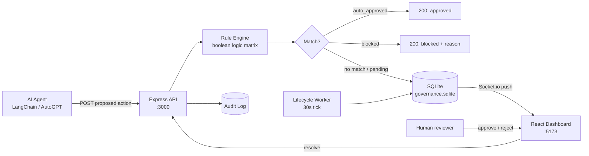

# Agent Governance Platform

A zero-trust human-in-the-loop governance layer for AI agents — every proposed action is intercepted, evaluated against a deterministic rule engine, and either auto-approved, blocked, or routed to a human reviewer in real time.

---

## The problem

Production AI agents (LangChain, AutoGPT, custom orchestrators) increasingly take real-world actions: changing prices, sending emails, executing trades, modifying records. The operating assumption — that an LLM will behave reasonably most of the time — is not a control plane. When something goes wrong, the post-mortem question is always the same: *who approved this, and on what basis?*

This platform answers that question by design. Agents do not act directly. They submit proposed actions to a governance API, which evaluates them against rules an operator wrote, and either lets the action through, blocks it, or escalates to a human via a real-time dashboard. Every decision is audited.

The audience is operators running agents against systems where a bad action has real cost.

---

## How it works



### Core mechanics

- **Zero-trust default.** If no rule matches the proposed action, the consequence is `require_approval`. Silence is never consent.
- **Boolean rule matrices.** Rules parse arbitrary JSON fields from the action payload using comparison operators (`>`, `<`, `=`, `>=`, `<=`). Operators write rules like "block any price change >15%" or "auto-approve refunds under $50."
- **Real-time HITL dashboard.** Pending actions are pushed to a React dashboard over Socket.io with full contextual reasoning and the original payload. Approve or reject in one click.
- **Lifecycle sweeps.** A background worker sweeps the SQLite store every 30 seconds, culling expired approvals and reconciling failed outcomes — so the queue cannot silently leak.
- **Audit log + scorecards.** Every decision is logged with rule match, decision, latency, and outcome. Per-agent scorecards track success rate, acceptance rate, and latency.

---

## Tech stack

| Layer | Choice | Why |
|-------|--------|-----|
| Runtime | Node.js 20+ | Async I/O fits the request-routing workload |
| API | Express | Minimal, well-understood, no framework lock-in |
| DB | SQLite (via Knex.js) | Zero ops for prototyping; Knex makes the Postgres migration path trivial |
| Real-time | Socket.io | Operator dashboards must receive pending actions instantly |
| Frontend | React + Vite | Fast HMR for iterating on operator UX |
| Monorepo | NPM workspaces | One `npm install` bootstraps both packages |

The SQLite + in-process worker stack is a deliberate prototyping choice. Production scale-out swaps SQLite for Postgres and the polling worker for `BullMQ` + Redis — the API and rule engine stay the same.

---

## Running locally

Requires **Node.js 20+**.

### 1. Install

From the monorepo root:

```bash
npm install
```

This bootstraps both `packages/api` and `packages/dashboard`.

### 2. Start the API

```bash
cd packages/api
npm run dev
```

The backend auto-initialises its SQLite schema in `packages/api/governance.sqlite` on startup and listens on port **3000**.

### 3. Start the dashboard

In a second terminal:

```bash
cd packages/dashboard
npm run dev
```

Vite serves the dashboard at port **5173**.

---

## Using the API

The system exposes RESTful endpoints to register agents and submit actions.

### 1. Bootstrap an owner + agent

```bash
# Generate a master user API key
POST http://localhost:3000/api/v1/auth/keys/user

# Generate an agent key tied to that owner
POST http://localhost:3000/api/v1/auth/keys/agent
```

### 2. Submit a proposed action

```bash
POST http://localhost:3000/api/v1/governance/request
Content-Type: application/json

{
  "agent_id": "your-agent-id",
  "action_type": "price_change",
  "proposed_value": {
    "item": "Tomatoes",
    "change_percentage": 0.15
  },
  "reasoning": "Matching competitive market hike."
}
```

The response is one of:

- `auto_approved` — a rule matched and allowed the action
- `blocked` — a rule matched and refused the action
- `pending_approval` — no rule matched (or a `require_approval` rule fired); the dashboard receives the request via Socket.io

---

## Architecture

```
agent-governance-platform/
├── packages/
│   ├── api/                 # Express + Knex + SQLite + Socket.io
│   │   ├── governance.sqlite      # auto-created on first run
│   │   ├── src/
│   │   │   ├── routes/            # REST endpoints
│   │   │   ├── engine/            # rule evaluation
│   │   │   ├── workers/           # lifecycle sweeper
│   │   │   └── db/                # Knex migrations + queries
│   │   └── package.json
│   └── dashboard/           # React + Vite + Socket.io-client + Axios
│       ├── src/
│       │   ├── components/
│       │   ├── hooks/
│       │   └── App.tsx
│       └── package.json
├── docker-compose.yml
├── package.json             # NPM workspaces root
└── README.md
```

---

## Roadmap

- **Production auth.** Current endpoints generate keys; bcrypt hashing + revocation for production.
- **Worker scale-out.** Move the lifecycle sweeper to BullMQ + Redis for higher agent concurrency.
- **SSO.** OAuth / SAML for team-based operator access.
- **Postgres adapter.** Knex makes this a config swap; needs migration script + production smoke tests.

---

Built by **Kenn Macharia** — [SuperiaTech](https://superiatech.vercel.app/)
